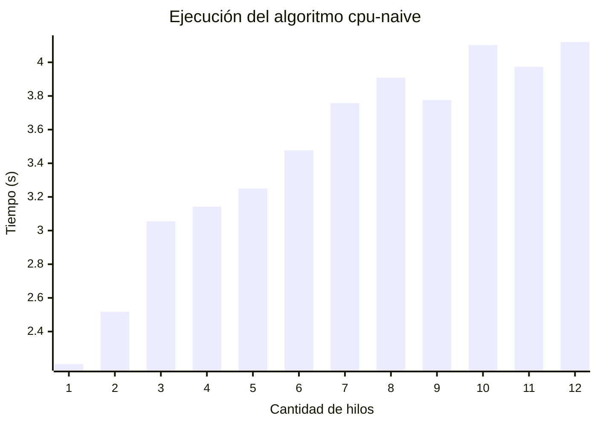
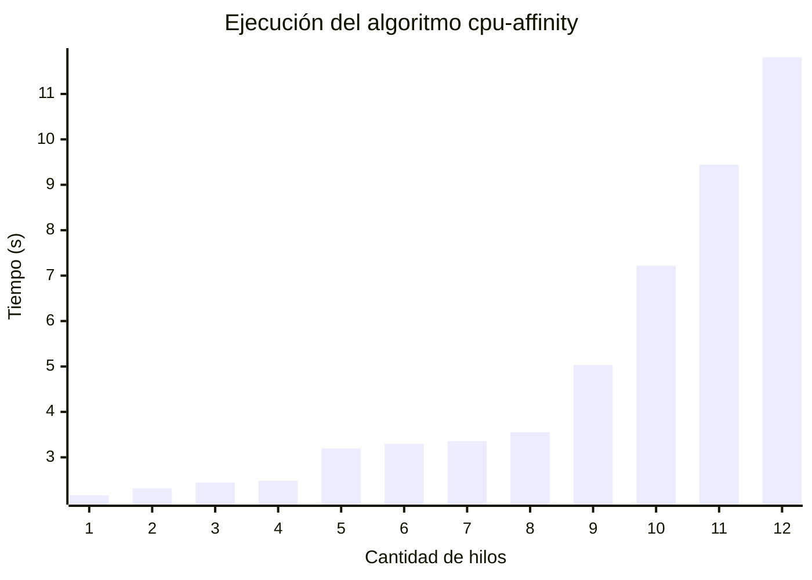
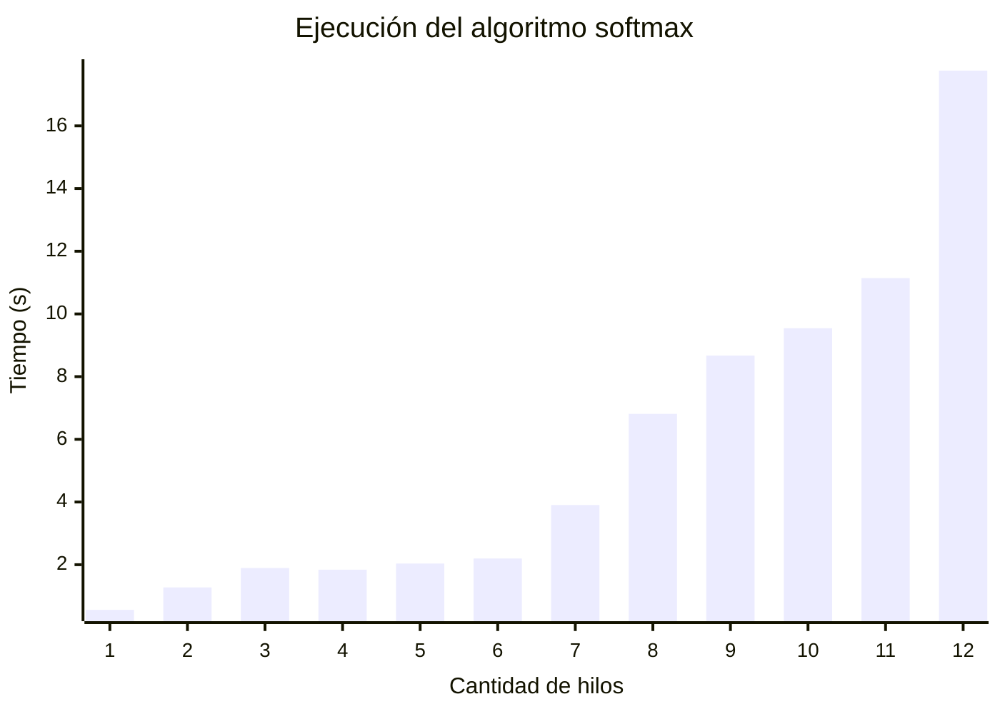
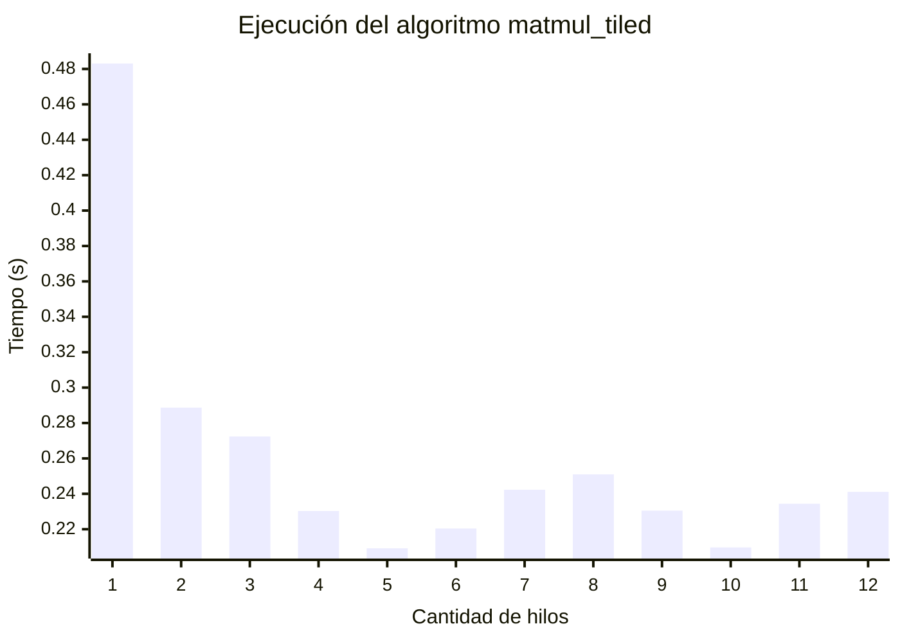

# Laboratorio 3
En este laboratorio de clase se medirá el rendimiento en cara a la escalabilidad, por supuesto, este laboratorio tratará sobre threads y los sistemas multinúcleo.
Primeramente, este dispositivo cuenta con 12 hilos y un solo dominio NUMA, se correrán 4 algoritmos, los cuales se graficarán y se analizarán los datos conforme a la teoría vista en clase.
## Comparación de cpu-affinity y cpu-naive

### Algoritmo cpu-naive

Este algoritmo deja al SO hacer los cambios de núcleo que el OS considere necesario, donde podría incurrir en enfriamiento de la RAM y throttling. Se obtienen las partes paralelas del código con Gustafson y se enumeran en la siguiente tabla:
| Hilos | T(n) (s) | Ψ(n) | p (Gustafson) |
|---|---|---|---|
| 1 | 2.208 | 1.00 | 100.0% |
| 2 | 2.518 | 1.75 | 75.4% |
| 3 | 3.055 | 2.17 | 58.4% |
| 4 | 3.142 | 2.81 | 60.4% |
| 5 | 3.250 | 3.40 | 59.9% |
| 6 | 3.477 | 3.81 | 56.2% |
| 7 | 3.757 | 4.11 | 51.9% |
| 8 | 3.909 | 4.52 | 50.3% |
| 9 | 3.775 | 5.26 | 53.3% |
| 10 | 4.103 | 5.38 | 48.7% |
| 11 | 3.973 | 6.11 | 51.1% |
| 12 | 4.120 | 6.43 | 49.4% |

La eficiencia débil se grafica en la siguiente tabla:

| Hilos | Tiempo (s) | Eficiencia débil `T(1)/T(n)` |
|---|---|---|
| 1 | 0.345 | 100.0% |
| 2 | 0.360 | 95.8% |
| 3 | 0.462 | 74.7% |
| 4 | 0.529 | 65.2% |
| 5 | 0.609 | 56.7% |
| 6 | 0.628 | 54.9% |
| 7 | 0.664 | 52.0% |
| 8 | 0.697 | 49.5% |
| 9 | 0.727 | 47.5% |
| 10 | 0.825 | 41.8% |
| 11 | 0.865 | 39.9% |
| 12 | 0.893 | 38.6% |

### Algoritmo cpu-affinity

Para este algortimo se usa afinidad de hilo y CPU para evitar la migración de memoria, al igual que evitar el throttling, haciendo en teoría más eficiente la ejecución. Para calcular su parte paralelizable se usa la fórmula de Gustafson para conseguir la siguiente ecuación y los siguientes resultados:

$$p = \frac{\Psi(n) - 1}{n - 1}$$
$$\Psi(n) = \frac{n \cdot T(1)}{T(n)}$$
| Hilos | T(n) (s) | Ψ(n) | p (Gustafson) |
|---|---|---|---|
| 1 | 2.169 | 1.00 | 100.0% |
| 2 | 2.317 | 1.87 | 87.2% |
| 3 | 2.448 | 2.66 | 82.9% |
| 4 | 2.483 | 3.49 | 83.1% |
| 5 | 3.193 | 3.40 | 59.9% |
| 6 | 3.294 | 3.95 | 59.0% |
| 7 | 3.356 | 4.52 | 58.7% |
| 8 | 3.552 | 4.89 | 55.5% |
| 9 | 5.032 | 3.88 | 36.0% |
| 10 | 7.217 | 3.01 | 22.3% |
| 11 | 9.442 | 2.53 | 15.3% |
| 12 | 11.806 | 2.21 | 11.0% |

También se puede ver la eficiencia débil del código en la siguiente tabla:

| Hilos | Tiempo (s) | Eficiencia débil `T(1)/T(n)` |
|---|---|---|
| 1 | 2.169 | 100.0% |
| 2 | 2.317 | 93.6% |
| 3 | 2.448 | 88.6% |
| 4 | 2.483 | 87.3% |
| 5 | 3.193 | 67.9% |
| 6 | 3.294 | 65.8% |
| 7 | 3.356 | 64.6% |
| 8 | 3.552 | 61.1% |
| 9 | 5.032 | 43.1% |
| 10 | 7.217 | 30.1% |
| 11 | 9.442 | 23.0% |
| 12 | 11.806 | 18.4% |

### Análisis de datos
En ambos algoritmos hay una clara tendencia a la desaceleración, a una baja de la eficiencia y la paralelización del código. Si se analiza el código, se puede ver que la memoria por thread siempre es la misma, lo que lo hace un problema de weak scaling a ambos algoritmos, donde el trabajo por hilo se mantiene igual, pero el problema en sí crece. Esta desaceleración puede ser provocada por un cada vez mayor uso de la RAM, lo que se conoce como resource starvation, comiéndose su ancho de banda y disminuyendo su troughput.

## Comparación de algoritmos softmax y matmul
### Algoritmo softmax

softmax() se llama 100 000 veces en un bucle, y cada llamada hace tres pasadas sobre un arreglo de solo 1000 doubles, estas pasadas generan partes paralelas, lo cual divide el código en acciones muy pequeñas, que es la característica de un algoritmo fine grain o de grano fino, que sería un algoritmo de strong scaling.

| Hilos | Tiempo (s) | Speedup `S(n)=T(1)/T(n)` | Eficiencia `S(n)/n` |
|---|---|---|---|
| 1 | 0.560 | 1.00× | 100.0% |
| 2 | 1.276 | 0.44× | 21.9% |
| 3 | 1.893 | 0.30× | 9.9% |
| 4 | 1.841 | 0.30× | 7.6% |
| 5 | 2.036 | 0.27× | 5.5% |
| 6 | 2.197 | 0.25× | 4.2% |
| 7 | 3.903 | 0.14× | 2.0% |
| 8 | 6.812 | 0.08× | 1.0% |
| 9 | 8.673 | 0.07× | 0.7% |
| 10 | 9.547 | 0.06× | 0.6% |
| 11 | 11.144 | 0.05× | 0.5% |
| 12 | 17.763 | 0.03× | 0.3% |

Se puede usar Amdahl para calcular la parte paralela:
| Hilos | S(n) | `p` (Amdahl) |
|---|---|---|
| 2 | 0.439 | −255.8% |
| 3 | 0.296 | −357.3% |
| 4 | 0.304 | −305.1% |
| 5 | 0.275 | −329.7% |
| 6 | 0.255 | −351.0% |
| 7 | 0.143 | −696.8% |
| 8 | 0.082 | −1276.5% |
| 9 | 0.065 | −1630.4% |
| 10 | 0.059 | −1783.9% |
| 11 | 0.050 | −2079.7% |
| 12 | 0.031 | −3352.5% |

### Algoritmo matmul_tiled

Este algoritmo tiene un tamaño fijo de matriz y se reparte un tamaño fijo entre todos los hilos, esto es un caso de strong scaling, el cual se puede modelar con la Ley de Amdahl para conseguir la eficiencia con la siguiente tabla:

| Hilos | Tiempo (s) | Speedup `S(n)=T(1)/T(n)` | Eficiencia `S(n)/n` |
|---|---|---|---|
| 1 | 0.4831 | 1.00× | 100.0% |
| 2 | 0.2888 | 1.67× | 83.6% |
| 3 | 0.2724 | 1.77× | 59.1% |
| 4 | 0.2303 | 2.10× | 52.4% |
| 5 | 0.2092 | 2.31×| 46.2% |
| 6 | 0.2204 | 2.19× | 36.5% |
| 7 | 0.2423 | 1.99× | 28.5% |
| 8 | 0.2510 | 1.92× | 24.1% |
| 9 | 0.2306 | 2.10× | 23.3% |
| 10 | 0.2098 | 2.30× | 23.0% |
| 11 | 0.2345 | 2.06× | 18.7% |
| 12 | 0.2411 | 2.00× | 16.7% |

También se usa Amdahl para modelar la parte paralela: `p = (1 - 1/S(n)) / (1 - 1/n)`

| Hilos | S(n) | `p` (Amdahl) |
|---|---|---|
| 2 | 1.673 | 80.4% |
| 3 | 1.773 | 65.4% |
| 4 | 2.097 | 69.8% |
| 5 | 2.309 | 70.9% |
| 6 | 2.192 | 65.2% |
| 7 | 1.993 | 58.1% |
| 8 | 1.925 | 54.9% |
| 9 | 2.095 | 58.8% |
| 10 | 2.303 | 62.9% |
| 11 | 2.060 | 56.6% |
| 12 | 2.003 | 54.6% |

 
### Análisis de datos
Ambos algoritmos son de escalamiento fuerte, pero hay un detalle con softmax, al introducir más hilos, debería ser más eficiente, pero esto no sucede, se puede ver con la parte paralela, donde la tabla da mayoritariamente da números negativos, esto puede ocurrir por el overhead de comunicación y sincronización de hilos, donde tener un montón de hilos (grano fino) que realizan una labor pequeña requiere mucha sincronización, creando overhead que termina haciendo la ejecución lenta entre más threads se introducen.
Para matmul, se ve un caso casi que de libro de los algoritmos de strong scaling, y ejemplificando la ley de Amdahl.